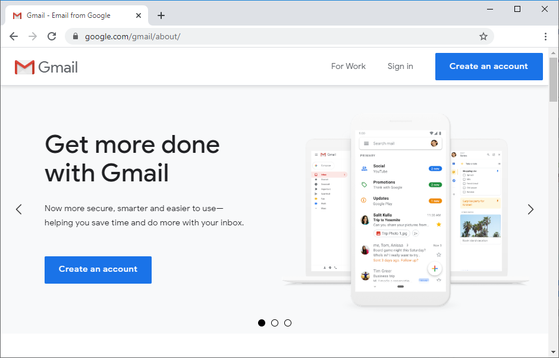

# Raspberry Pi: Send an Email using Python (SMTP Server)

## Introducing SMTP Servers

SMTP means *Simple Mail Transfer Protocol* and it is an internet standard for email transmission. You can easily send emails using a Python Script on your Raspberry Pi using the smtplib library. This library defines an SMTP client session object that can be used to send mails. [Learn more here](https://docs.python.org/3/library/smtplib.html).

### SMTP Server Settings

To send emails using a Python script on your Raspberry Pi, you need a sender email and you'll need to know your email SMTP server settings. Below you'll find the settings for the most popular email providers.

#### Gmail SMTP Server Settings

If you're using a Gmail account, these are the SMTP Server details:

- SMTP Server: smtp.gmail.com
- SMTP username: Complete Gmail address
- SMTP password: Your Gmail password
- SMTP port (TLS): 587
- SMTP port (SSL): 465
- SMTP TLS/SSL required: yes

#### Outlook SMTP Server Settings

For Outlook accounts, these are the SMTP Server settings:

- SMTP Server: smtp.office365.com
- SMTP Username: Complete Outlook email address
- SMTP Password: Your Outlook password
- SMTP Port: 587
- SMTP TLS/SSL Required: Yes

#### Live or Hotmail SMTP Server Settings

For Live or Hotmail accounts, these are the SMTP Server settings:

- SMTP Server: smtp.live.com
- SMTP Username: Complete Live/Hotmail email address
- SMTP Password: Your Windows Live Hotmail password
- SMTP Port: 587
- SMTP TLS/SSL Required: Yes

If you're using another email provider, you need to search for its SMTP Server settings---you'll easily find them with a quick google search.

## Sender Email (New Account)

We recommend creating a new email account to send the emails to your main personal email address. Do not use your main personal email to send emails via a Python script. If something goes wrong in your code or if by mistake you make too many requests, you can be banned or have your account temporarily disabled.

We'll use a newly created Gmail.com account to send the emails, but you can use any other email provider. The receiver email can be your personal email without any problem.

### Create a Sender Email Account

Create a new email account for sending emails with the ESP32/ESP8266. If you want to use a Gmail account, [go to this link](https://www.google.com/gmail/about/) to create a new one.



### Create an App Password

You need to create an app password so that new devices can send emails using your Gmail account. An App Password is a 16-digit passcode that gives a less secure app or device permission to access your Google Account. [Learn more about sign-in with app passwords here](https://support.google.com/accounts/answer/185833).

An app password can only be used with accounts that have [2-step verification turned on](https://support.google.com/accounts/answer/185839).

1. Open your [Google Account](https://myaccount.google.com/).
1. In the navigation panel, select Security.
1. Under "Signing in to Google," select 2-Step Verification > Get started.
1. Follow the on-screen steps.

After enabling 2-step verification, you can create an app password.

1. Open your [Google Account](https://myaccount.google.com/).
1. In the navigation panel, select Security.
1. Under "Signing in to Google," select App Passwords.

If you don't find this option, use the search tool on that page and search for App passwords.


1. In the Select app field, choose mail. For the device, select Other and give it a name, for example *Raspberry Pi.* Then, click on Generate. It will pop-up a window with a password that you'll use on the Python script to send emails. Save that password (even though it says you won't need to remember it) because you'll need it later.


Now, you should have an app password that you can use on your Python script to send emails.

If you're using another email provider, check how to create an app password. You should be able to find the instructions with a quick Google search "your_email_provider + create app password".

## The Email-Sending Script

Create a new Python file called *send_email.py* and copy the following code.

You need to insert your sender email details and the recipient email.

```
# Complete Project Details: https://RandomNerdTutorials.com/raspberry-pi-send-email-python-smtp-server/

import smtplib
import json
from email.message import EmailMessage

with open('pihole_configs.json', 'r') as file:
    config = json.load(file)

#Set the sender email and password and recipient emaiç
from_email_addr ="REPLACE_WITH_THE_SENDER_EMAIL"
from_email_pass ="REPLACE_WITH_THE_SENDER_EMAIL_APP_PASSWORD"
to_email_addr ="REPLACE_WITH_THE_RECIPIENT_EMAIL"

# Create a message object
msg = EmailMessage()

# Set the email body
body ="Hello from Raspberry Pi"
msg.set_content(body)

# Set sender and recipient
msg['From'] = from_email_addr
msg['To'] = to_email_addr

# Set your email subject
msg['Subject'] = 'TEST EMAIL'

# Connecting to server and sending email
# Edit the following line with your provider's SMTP server details
server = smtplib.SMTP('smtp.gmail.com', 587)

# Comment out the next line if your email provider doesn't use TLS
server.starttls()
# Login to the SMTP server
server.login(from_email_addr, from_email_pass)

# Send the message
server.send_message(msg)

print('Email sent')

#Disconnect from the Server
server.quit()

```

[View raw code](https://github.com/RuiSantosdotme/Random-Nerd-Tutorials/raw/master/Projects/Raspberry-Pi/send_email.py)

### How the Code Works

Continue reading to learn how the code works and what changes you need to make to the script to make it work for you.

You start by importing the libraries you need for SMTP and email-related functions: smtplib and the EmailMessage class from the email.message module.

```
import smtplib
import json
from email.message import EmailMessage

with open('pihole_configs.json', 'r') as file:
    config = json.load(file)
```

Next, you create variables for the email address to send from, that email's app password, and an email address to send to. We suggest you create a second email to send the notifications to your everyday email because you will be giving less secure apps access to the account you send from.

```
#Set the sender email and password and recipient emaiç
from_email_addr ="REPLACE_WITH_THE_SENDER_EMAIL"
from_email_pass ="REPLACE_WITH_THE_SENDER_EMAIL_APP_PASSWORD"
to_email_addr ="REPLACE_WITH_THE_RECIPIENT_EMAIL"
```

Create an EmailMessage() object called msg that will handle the email message properties.

```
# Create a message object
msg = EmailMessage()
```

Set the email body on the following lines. You can change it to whatever text you want.

```
# Set the email body
body ="Hello from Raspberry Pi"
msg.set_content(body)
```

Then, we set the sender and recipient in the email message properties.

```
msg['From'] = from_email_addr
msg['To'] = to_email_addr
```

The following line sets the email subject, you can change it to whatever you want.

```
msg['Subject'] = 'TEST EMAIL'
```

Then, you establish communication with an SMTP server. Pass the provider's SMTP server address as a string as the first argument to smtplib.SMTP(), and the port as an int as the second argument.

```
server = smtplib.SMTP('smtp.gmail.com', 587)
```

In this script, we're using a Gmail SMTP server and port. If you use another email provider, make sure to change those values.

The server.starttls() function is necessary for email providers that use TLS to encrypt messages (which are practically all email providers). If your email provider doesn't use TLS, you can remove or comment out that line.

```
server.starttls()
```

Next, the script logs into the sending email account and sends the email.

```
# Send the message
server.send_message(msg)
```

Finally, we stop the communication with the server.

```
server.quit()
```

## Demonstration

Save your Python file. Then run it on your Raspberry Pi. Run the following command on the directory of your project file (use the name of your file):

```
python send_email.py
```

After running the script, you should receive an email from the Raspberry Pi on your email account.


## Wrapping Up

In this tutorial, you learned how to send an email with the Raspberry Pi using a Python script. This example is also compatible with other boards/machines that support Python 3.

<small>Original instructions: <https://randomnerdtutorials.com/raspberry-pi-send-email-python-smtp-server/></small>